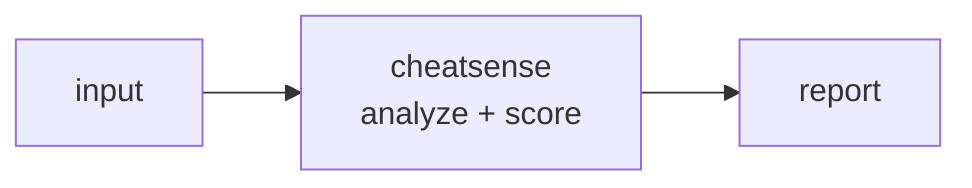

<a name="top"></a>
<div align="center">


# CHEATSENSE

### Anti-cheat telemetry analyzer that ingests game session logs and flags statistically anomalous input/aim/movement signatures with explainable per-flag scoring.


[](https://pypi.org/project/cognis-cheatsense/) [](https://github.com/cognis-digital/cheatsense/actions) [](LICENSE) [](https://github.com/cognis-digital)

*Application & Mobile Security — SAST/DAST-lite and binary triage.*

</div>

```bash
pip install cognis-cheatsense
cheatsense scan .            # → prioritized findings in seconds
```

## Usage — step by step

1. **Install:**

   ```bash
   pip install -e .
   ```

2. **Scan a session input log** (JSONL lines, or a JSON list/object) with the `scan` subcommand to flag anomalous input signatures — inhuman reaction time, robotic cadence, aim snaps, impossible APM, autoclicker intervals:

   ```bash
   cheatsense scan demos/01-basic/session.jsonl
   ```

3. **Tune the detection thresholds** — `--flag-score` (0-100 cheat-likelihood at which a player is flagged), `--max-apm` (sustained APM ceiling), `--min-reaction-ms` (human reaction floor), `--max-interval-cv` (interval regularity):

   ```bash
   cheatsense scan session.jsonl --flag-score 40 --max-apm 600
   ```

4. **Read the result.** The table lists each `PLAYER`, event count, cheat `SCORE`, `FLAG`, and finding codes, with a detail block per flagged player. Use `--format json` for piping. The process **exits 1 when one or more players are flagged**, **0 when clean**, **2 on input error**:

   ```bash
   cheatsense scan session.jsonl --format json | jq '.flagged_count'
   ```

5. **Use it in CI / batch review** — fail a match-review job when any player trips the anti-cheat heuristics:

   ```bash
   cheatsense scan session.jsonl --format json || { echo "Cheating suspected"; exit 1; }
   ```


## Contents

- [Why cheatsense?](#why) · [Features](#features) · [Quick start](#quick-start) · [Example](#example) · [Architecture](#architecture) · [AI stack](#ai-stack) · [How it compares](#how-it-compares) · [Integrations](#integrations) · [Install anywhere](#install-anywhere) · [Related](#related) · [Contributing](#contributing)

<a name="why"></a>
## Why cheatsense?

Commercial anti-cheats are black boxes; indie game studios have nothing. cheatsense is an auditable, self-hostable CLI that turns raw match logs into reviewable cheat-likelihood reports.

`cheatsense` is single-purpose, scriptable, and self-hostable: point it at a target, get prioritized results in the format your workflow already speaks (table · JSON · SARIF), gate CI on it, and let agents drive it over MCP.

<div align="right"><a href="#top">↑ back to top</a></div>

<a name="features"></a>
## Features

- ✅ Parse Events
- ✅ Analyze
- ✅ Analyze File
- ✅ Runs on Linux/macOS/Windows · Docker · devcontainer
- ✅ Ports in Python, JavaScript, Go, and Rust (`ports/`)

<div align="right"><a href="#top">↑ back to top</a></div>

<a name="quick-start"></a>
## Quick start

```bash
pip install cognis-cheatsense
cheatsense --version
cheatsense scan .                       # scan current project
cheatsense scan . --format json         # machine-readable
cheatsense scan . --fail-on high        # CI gate (non-zero exit)
```

<div align="right"><a href="#top">↑ back to top</a></div>

<a name="example"></a>
## Example

```text
$ cheatsense scan .
  [HIGH    ] CHE-001  example finding             (./src/app.py)
  [MEDIUM  ] CHE-002  another signal              (./config.yaml)

  2 findings · risk score 5 · 38ms
```

<div align="right"><a href="#top">↑ back to top</a></div>

<a name="architecture"></a>
## Architecture



<div align="right"><a href="#top">↑ back to top</a></div>

<a name="ai-stack"></a>
## Use it from any AI stack

`cheatsense` is interoperable with every popular way of using AI:

- **MCP server** — `cheatsense mcp` (Claude Desktop, Cursor, Cognis.Studio, [uncensored-fleet](https://github.com/cognis-digital/uncensored-fleet))
- **OpenAI-compatible / JSON** — pipe `cheatsense scan . --format json` into any agent or LLM
- **LangChain · CrewAI · AutoGen · LlamaIndex** — wrap the CLI/JSON as a tool in one line
- **CI / scripts** — exit codes + SARIF for non-AI pipelines

<div align="right"><a href="#top">↑ back to top</a></div>

<a name="how-it-compares"></a>
## How it compares

| | **Cognis cheatsense** | Open-source anti-cheat efforts like AntiCheat-Bypass research tooling and the BattlEye |
|---|:---:|:---:|
| Self-hostable, no account | ✅ | varies |
| Single command, zero config | ✅ | ⚠️ |
| JSON + SARIF for CI | ✅ | varies |
| MCP-native (AI agents) | ✅ | ❌ |
| Polyglot ports (JS/Go/Rust) | ✅ | ❌ |
| Open license | ✅ COCL | varies |

*Built in the spirit of **Open-source anti-cheat efforts like AntiCheat-Bypass research tooling and the BattlEye/EAC heuristic model, but transparent and self-hosted**, re-framed the Cognis way. Missing a credit? Open a PR.*

<div align="right"><a href="#top">↑ back to top</a></div>

<a name="integrations"></a>
## Integrations

Pipes into your stack: **SARIF** for code-scanning, **JSON** for anything, an **MCP server** (`cheatsense mcp`) for AI agents, and a webhook forwarder for SIEM/Slack/Jira. See [`docs/INTEGRATIONS.md`](docs/INTEGRATIONS.md).

<div align="right"><a href="#top">↑ back to top</a></div>

<a name="install-anywhere"></a>
## Install — every way, every platform

```bash
pip install "git+https://github.com/cognis-digital/cheatsense.git"    # pip (works today)
pipx install "git+https://github.com/cognis-digital/cheatsense.git"   # isolated CLI
uv tool install "git+https://github.com/cognis-digital/cheatsense.git" # uv
pip install cognis-cheatsense                                          # PyPI (when published)
docker run --rm ghcr.io/cognis-digital/cheatsense:latest --help        # Docker
brew install cognis-digital/tap/cheatsense                             # Homebrew tap
curl -fsSL https://raw.githubusercontent.com/cognis-digital/cheatsense/main/install.sh | sh
```

| Linux | macOS | Windows | Docker | Cloud |
|---|---|---|---|---|
| `scripts/setup-linux.sh` | `scripts/setup-macos.sh` | `scripts/setup-windows.ps1` | `docker run ghcr.io/cognis-digital/cheatsense` | [DEPLOY.md](docs/DEPLOY.md) (AWS/Azure/GCP/k8s) |

<div align="right"><a href="#top">↑ back to top</a></div>

<a name="related"></a>
## Related Cognis tools

- [`apkpeek`](https://github.com/cognis-digital/apkpeek) — One-command static triage of Android APK/AAB binaries: surfaces hardcoded secrets, exported components, dangerous permissions, and insecure manifest flags as a single SARIF report.
- [`ipasnitch`](https://github.com/cognis-digital/ipasnitch) — Static scanner for iOS .ipa bundles that flags ATS exceptions, missing entitlements hardening, embedded URLs/secrets, and weak Info.plist transport settings.
- [`hookcraft`](https://github.com/cognis-digital/hookcraft) — Generates ready-to-run Frida instrumentation scripts from a YAML intent (e.g. 'bypass SSL pinning', 'dump crypto keys') and verifies they attach to a target process.
- [`dastlite`](https://github.com/cognis-digital/dastlite) — A headless, config-as-code DAST runner that crawls an authenticated web/mobile-API surface and fires a curated active-scan ruleset, emitting deduplicated SARIF.
- [`semsift`](https://github.com/cognis-digital/semsift) — Lightweight semantic-aware SAST that runs curated taint rules over diffs only, so PRs get fast incremental SAST instead of whole-repo scan fatigue.
- [`binhunt`](https://github.com/cognis-digital/binhunt) — Game/desktop binary integrity scanner that fingerprints executables, detects common packers/obfuscators, and diffs against a known-good baseline to catch tampering.

**Explore the suite →** [🗂️ all 170+ tools](https://github.com/cognis-digital/cognis-neural-suite) · [⭐ awesome-cognis](https://github.com/cognis-digital/awesome-cognis) · [🔗 cognis-sources](https://github.com/cognis-digital/cognis-sources) · [🤖 uncensored-fleet](https://github.com/cognis-digital/uncensored-fleet) · [🧠 engram](https://github.com/cognis-digital/engram)

<div align="right"><a href="#top">↑ back to top</a></div>

<a name="contributing"></a>
## Contributing

PRs, new rules, and demo scenarios are welcome under the collaboration-pull model — see [CONTRIBUTING.md](CONTRIBUTING.md) and [SECURITY.md](SECURITY.md).

> ### ⭐ If `cheatsense` saved you time, **star it** — it genuinely helps others find it.

## License

Source-available under the **Cognis Open Collaboration License (COCL) v1.0** — free for personal, internal-evaluation, research, and educational use; **commercial / production use requires a license** (licensing@cognis.digital). See [LICENSE](LICENSE).

---

<div align="center"><sub><b><a href="https://cognis.digital">Cognis Digital</a></b> · one of 170+ tools in the <a href="https://github.com/cognis-digital/cognis-neural-suite">Cognis Neural Suite</a> · <i>Making Tomorrow Better Today</i></sub></div>
